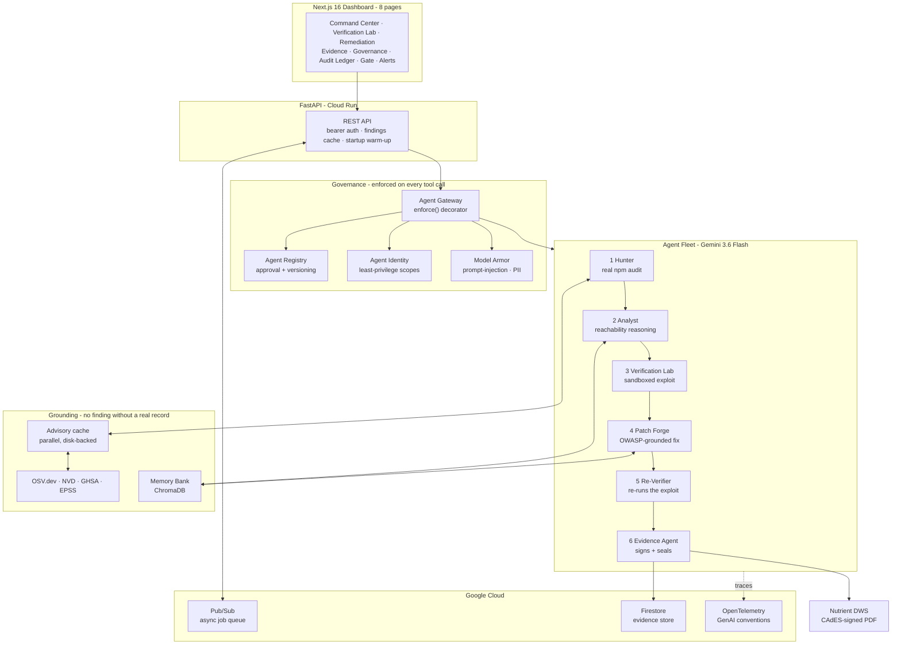

# SENTINEL — Evidence-Driven Autonomous Security Verification Fleet

A fleet of autonomous agents that takes a raw dependency-scanner finding and
carries it all the way to a cryptographically sealed, human-reviewable
verdict — deciding for itself whether the vulnerability is actually
exploitable in *this* codebase, proving it in a sandbox, writing the fix,
re-testing it, and sealing the evidence.

**The problem it removes:** a scanner reports 25 "critical" vulnerabilities.
A security engineer spends days determining that most of them are unreachable
in this application and irrelevant. SENTINEL does that triage itself,
autonomously, and produces the evidence trail that proves each conclusion.

---

## Architecture



**Orchestration is swappable at runtime** via `SENTINEL_ORCHESTRATOR`:

| Value | Path | Used for |
|---|---|---|
| `direct` (default) | deterministic Python pipeline | fastest, fully reproducible |
| `adk` | **Google ADK** `SequentialAgent` over 6 real `LlmAgent`s | All Things Agentic |
| `strands` | **AWS Strands** `Agent` with a Gemini model provider | Agents for Humans |

All three drive the *same* tools in `app/agent_tools.py`, so the orchestrator
changes how the fleet is coordinated without changing what it actually does.

---

## The two things that make this different

**1. Verdicts are earned in a sandbox, not asserted by a model.**
Analyst forms a reachability hypothesis, but Verification Lab then clones the
repo into a real git worktree and *executes* an exploit attempt against it.
A finding is only marked exploitable if the exploit actually worked. Patch
Forge is likewise forbidden from improvising: if there is no OWASP-grounded
remediation pattern for the CWE, it escalates to a human rather than
inventing a fix.

**2. Two independent seals that are allowed to disagree.**
Every evidence record carries a SHA-256 content signature over its JSON *and*
a Nutrient DWS CAdES-signed PDF digest. They cover different things, so they
catch different tampering:

| Scenario | Content signature | DWS seal |
|---|---|---|
| Record JSON edited | fails | passes |
| Signed PDF swapped or edited | passes | fails |

*Verified by flipping a single byte in a real signed PDF and watching exactly
one of the two seals fail.* A single seal would have missed it.

---

## Quick Start (local, no cloud account needed)

**Requirements:** Python 3.12+, Node 20+, and `git` + `npm` on `PATH`
(Hunter shells out to both).

```bash
# 1. Backend
cd backend
python -m venv .venv
source .venv/Scripts/activate      # Windows;  .venv/bin/activate on macOS/Linux
pip install -r requirements.txt
```

Create `backend/.env` (gitignored, never committed):

```
GEMINI_API_KEY=your-key-here
NUTRIENT_API_KEY=your-key-here
```

`NUTRIENT_API_KEY` is optional and enables the CAdES-signed PDF seal.

```bash
# 2. Start the API - answers immediately, scan warms in the background
python -m uvicorn app.server:app --port 8000

# 3. Second terminal - the async worker
cd backend && source .venv/Scripts/activate
python -m app.worker

# 4. Third terminal - the dashboard
npm install && npm run dev         # http://localhost:3000
```

Open <http://localhost:3000>, pick a finding, and press **Start
Investigation**. A full run takes roughly 10-15 minutes because every stage
is real: a real clone, a real `npm audit`, real Gemini reasoning, and a real
sandboxed exploit attempt.

---

## Deploy to Google Cloud Run

The backend ships as a container. `git` and Node are installed in the image
because Hunter genuinely invokes them - a plain Python base image starts
fine and then fails at the first scan.

```bash
# One-time project setup
gcloud services enable run.googleapis.com firestore.googleapis.com \
    pubsub.googleapis.com artifactregistry.googleapis.com cloudbuild.googleapis.com
gcloud artifacts repositories create sentinel --repository-format=docker --location=us-central1
gcloud firestore databases create --location=nam5

# Secrets stay in Secret Manager - never in the image
printf '%s' "$GEMINI_API_KEY"   | gcloud secrets create gemini-api-key   --data-file=-
printf '%s' "$NUTRIENT_API_KEY" | gcloud secrets create nutrient-api-key --data-file=-

# Build + deploy
gcloud builds submit --config deploy/cloudbuild.yaml \
    --substitutions=_REGION=us-central1,_SERVICE=sentinel-api
```

The deploy sets `SENTINEL_STORE_BACKEND=firestore` and
`SENTINEL_QUEUE_BACKEND=pubsub`, which is what moves the evidence store and
job queue off the local filesystem onto **Firestore** and **Pub/Sub**. The
Pub/Sub topic and subscription are created automatically on first use.

Run it locally exactly as Cloud Run does:

```bash
docker build -t sentinel-backend backend
docker run -p 8080:8080 -e PORT=8080 -e GEMINI_API_KEY=... sentinel-backend
```

---

## Enterprise controls (Fortified Enterprise Fleet)

| Pillar | Implementation | Evidence it is real |
|---|---|---|
| **Agent Registry** | `governance/registry.py` | Unregistered or unapproved agents are refused at the gateway |
| **Agent Identity** | `governance/identity.py` | Per-agent scopes; Analyst cannot open a PR |
| **Agent Gateway** | `governance/gateway.py` | `enforce()` wraps every tool call; appends to `gateway_log.jsonl` |
| **Model Armor** | `governance/model_armor.py` | Blocks prompt injection and PII inline; `model_armor_log.jsonl` |
| **Agent Runtime** | `queue/` + `worker.py` | Durable async jobs - close the laptop, come back later |
| **Memory Bank** | `memory.py` (ChromaDB) | Prior verdicts and verified fixes recalled across sessions |
| **Observability** | `observability.py` | OpenTelemetry spans using GenAI semantic conventions |
| **Audit trail** | `ledger.py` | SHA-256 hash-chained; any edit breaks the chain |

Try it on the **Governance** page: submit `patch-forge: deploy to production`
to the live policy simulator and watch the same code path the fleet runs
through return `REQUIRES_HUMAN`.

---

## Tests

```bash
cd backend && python -m pytest      # 131 tests
npm run test                        # 23 tests
```

These are security-invariant tests, not coverage padding. Each has been
checked to genuinely fail when the property it protects is broken:
disabling the production-deploy guard fails 31 of them, reverting the
Pub/Sub provisioning fix fails the topology tests, and changing the frontend
ledger delimiter fails the cross-language contract tests.

---

## No fabricated data

Every number in the dashboard traces to something real: findings come from
`npm audit` against a genuinely vulnerable repo (OWASP Juice Shop), advisory
records from OSV/NVD/GHSA, exploitability from sandbox execution, and
reasoning from live Gemini calls. There are no seeded fixtures behind the
UI. When a knowledge source is unreachable the scan is explicitly reported
as **degraded** rather than silently returning fewer findings.

---

## Configuration

| Variable | Default | Purpose |
|---|---|---|
| `GEMINI_API_KEY` | - | **Required.** Gemini API access |
| `GEMINI_MODEL` | `gemini-3.6-flash` | Model for all agents (must stay Gemini 3.5+) |
| `NUTRIENT_API_KEY` | - | Enables the CAdES-signed PDF seal |
| `SENTINEL_ORCHESTRATOR` | `direct` | `direct` \| `adk` \| `strands` |
| `SENTINEL_STORE_BACKEND` | `local` | `local` \| `firestore` \| `dynamodb` |
| `SENTINEL_QUEUE_BACKEND` | `local` | `local` \| `pubsub` \| `eventbridge` |
| `SENTINEL_API_TOKENS` | - | `principal:token,...` - enables auth |
| `GCP_PROJECT_ID` | - | Required for Firestore and Pub/Sub |
| `SENTINEL_GROUNDING_CONCURRENCY` | `8` | Parallel advisory lookups |

> Without `SENTINEL_API_TOKENS`, mutating endpoints accept unauthenticated
> calls and record the actor as `local-dev (unauthenticated)`. Set it before
> exposing the API to anyone.
